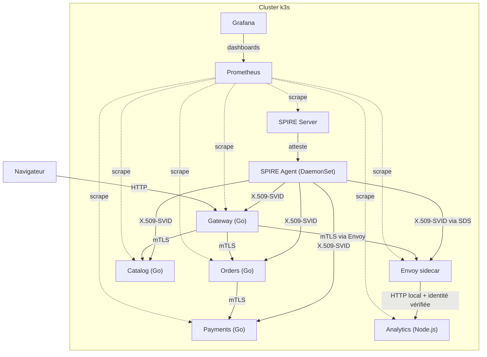
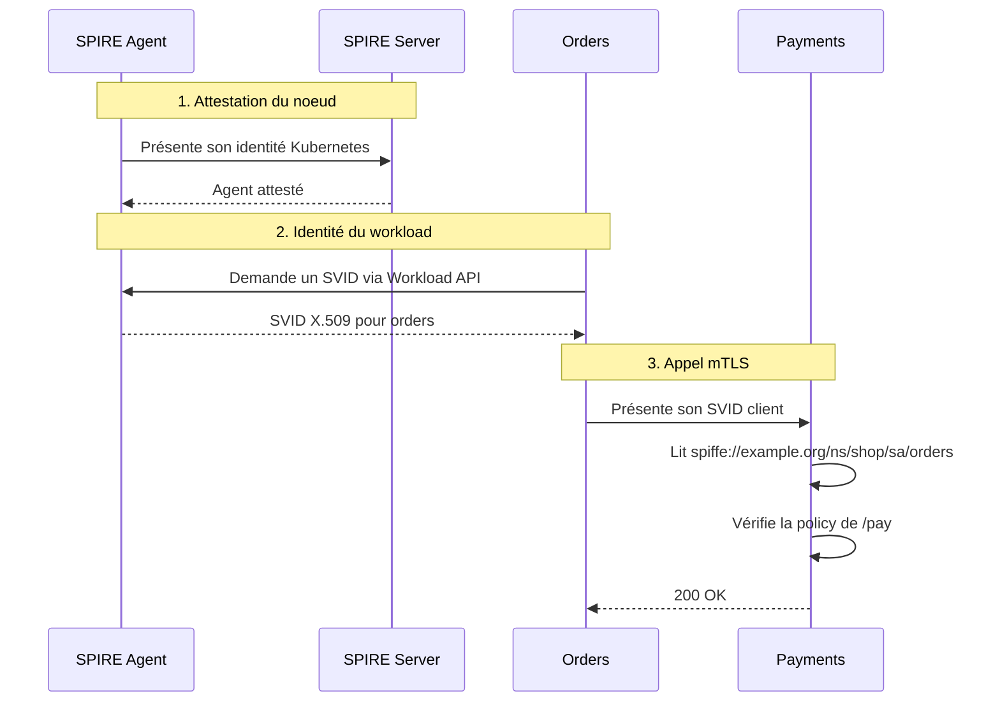
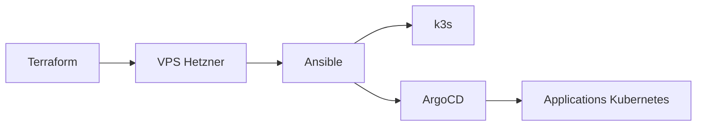
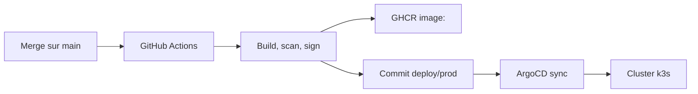

# SPIRE Zero-Trust mTLS

Mini-boutique en microservices déployée sur k3s, où chaque workload possède une identité cryptographique SPIFFE, communique en mTLS et applique des règles d'autorisation explicites.

Le projet illustre une approche zero-trust appliquée aux communications internes : le réseau ne suffit pas à établir la confiance. Chaque service doit prouver son identité, puis être autorisé pour l'action demandée.

## Vue d'ensemble

La plateforme est provisionnée sur un VPS Hetzner avec Terraform, configurée avec Ansible, puis pilotée par ArgoCD. Les images applicatives sont construites par GitHub Actions, scannées, signées, publiées sur GHCR et déployées via une branche GitOps dédiée.

Au runtime, SPIRE émet des identités courtes durées sous forme de X.509-SVID. Les services Go utilisent directement `go-spiffe/v2` pour récupérer leur SVID, établir le mTLS et lire l'identité de l'appelant. Le service Analytics, écrit en Node.js, est placé derrière Envoy : le proxy prend en charge SPIFFE/mTLS et transmet l'identité vérifiée à l'application.

Prometheus collecte les métriques SPIRE, Envoy et applicatives. Grafana expose les dashboards SVID, trafic HTTP, décisions d'autorisation et activité du mode démo.

## Services

| Service | Rôle | Communications |
|---------|------|----------------|
| Gateway | Point d'entrée HTTP, sert le front | Appelle Orders et Catalog |
| Orders | Gère les commandes | Appelle Payments |
| Catalog | Expose le catalogue | N'appelle aucun service sensible |
| Payments | Traite les paiements | Accepte `/pay` depuis Orders |
| Analytics | Compteur d'événements et de vues en Node.js | Reçoit une identité vérifiée par Envoy |

La règle sensible est volontairement simple : **seul Orders peut déclencher un paiement**. Gateway peut orchestrer une commande, Catalog peut exposer les produits, mais aucun des deux ne doit pouvoir appeler directement l'action de paiement.

Analytics sert de service applicatif multi-langage. Il reçoit des événements simples depuis la Gateway, incrémente des compteurs en mémoire et expose ses métriques. L'application Node.js ne manipule pas directement les certificats SPIFFE ; Envoy porte le mTLS et lui transmet l'identité vérifiée.

## Architecture runtime



Le navigateur ne parle qu'à la Gateway. Les appels internes passent en mTLS. Les services Go gèrent directement leur configuration TLS ; Analytics délègue cette responsabilité à Envoy.

## Identité SPIFFE

Chaque workload Kubernetes possède un `ServiceAccount`. SPIRE utilise ces informations pour attribuer une identité au format :

```text
spiffe://example.org/ns/<namespace>/sa/<service-account>
```

Exemples :

```text
spiffe://example.org/ns/shop/sa/gateway
spiffe://example.org/ns/shop/sa/orders
spiffe://example.org/ns/shop/sa/catalog
spiffe://example.org/ns/shop/sa/payments
```

Ces identités sont portées par des X.509-SVIDs. Un SVID contient le SPIFFE ID du workload, une clé privée associée et une chaîne de confiance permettant de vérifier les pairs.

## mTLS dans les services Go

Les services Go récupèrent leur identité via le Workload API exposé par le SPIRE Agent :

```go
source, err := workloadapi.NewX509Source(ctx,
    workloadapi.WithClientOptions(workloadapi.WithAddr(socketPath)))
```

La même source est utilisée côté client pour présenter son certificat et vérifier le serveur :

```go
clientTLS := tlsconfig.MTLSClientConfig(
    source,
    source,
    tlsconfig.AuthorizeID(paymentsSPIFFE),
)
```

Côté serveur, le service exige un certificat client valide du trust domain :

```go
serverTLS := tlsconfig.MTLSServerConfig(
    source,
    source,
    tlsconfig.AuthorizeMemberOf(td),
)
```

Après le handshake TLS, l'application lit l'identité de l'appelant depuis le certificat client :

```go
id, err := spiffeid.FromURI(r.TLS.PeerCertificates[0].URIs[0])
```

Le SPIFFE ID n'est pas transmis par un header forgeable : il est vérifié pendant le handshake mTLS.

## mTLS avec Envoy

Analytics ne manipule pas directement les certificats SPIFFE. Envoy récupère les SVIDs auprès du SPIRE Agent via SDS, établit les connexions mTLS et vérifie l'identité des pairs.

Une fois le pair authentifié, Envoy transmet la requête au service Node.js sur l'interface locale. L'identité vérifiée peut être transmise à l'application via un header contrôlé par le proxy, par exemple `x-forwarded-client-cert` ou un header interne dédié.

Ce modèle permet de garder la même sécurité runtime pour des services écrits dans plusieurs langages, sans réimplémenter la logique SPIFFE/mTLS dans chaque application.

## Autorisation

L'authentification répond à la question : **qui appelle ?**

L'autorisation répond à la question : **cette identité a-t-elle le droit d'effectuer cette action ?**

Dans les services Go, l'autorisation est appliquée dans le code à partir du SPIFFE ID extrait du certificat client :

```go
var policy = map[string][]string{
    "/pay":    {ordersID},
    "/_calls": {gatewayID},
}
```

Un service peut donc être authentifié mais refusé. Gateway possède une identité SPIFFE valide, mais `Payments /pay` n'autorise que Orders.

Les règles transverses peuvent aussi être appliquées dans Envoy, avant que la requête atteigne l'application. Les décisions métier restent dans le code applicatif lorsqu'elles dépendent du contexte fonctionnel.

## Observabilité

Prometheus collecte trois familles de métriques :

- métriques SPIRE : émissions de SVID, renouvellements, expirations et erreurs d'attestation ;
- métriques applicatives : requêtes HTTP, latence, appelants SPIFFE, décisions `allowed` ou `denied` ;
- métriques Envoy : trafic upstream, statuts HTTP, décisions RBAC et erreurs mTLS.

Grafana expose les dashboards de suivi :

- état SPIRE Server / Agent ;
- volume de SVIDs émis et expirations proches ;
- trafic par service, route et statut HTTP ;
- appels autorisés/refusés sur les routes sensibles ;
- activité Analytics derrière Envoy.

Chaque service expose un endpoint `/metrics`. Les décisions d'autorisation sont instrumentées pour rendre visible la différence entre un appel authentifié et un appel réellement autorisé.

## Mode démo

La Gateway expose un mode démo qui génère automatiquement du trafic contrôlé :

- commandes valides `Gateway -> Orders -> Payments` ;
- tentatives interdites vers `Payments /pay` ;
- appels au catalogue ;
- événements envoyés vers Analytics derrière Envoy.

Ce trafic alimente Prometheus et permet de visualiser immédiatement dans Grafana les émissions de SVID, les appels mTLS, les statuts HTTP et les refus d'autorisation.

## Flux d'attestation



## Déploiement plateforme



Terraform provisionne l'infrastructure : serveur, réseau, firewall, clé SSH et IP publique.

Ansible configure la machine de manière idempotente : installation de k3s, installation d'ArgoCD, accès au cluster et bootstrap des applications ArgoCD.

ArgoCD surveille l'état déclaré dans Git et réconcilie le cluster automatiquement.

## Durcissement & accès serveur

L'administration courante de la plateforme passe par GitOps (ArgoCD) et `kubectl`, pas par SSH. SSH est traité comme un accès *break-glass* : un canal de secours pour le provisioning et le debug, jamais un accès d'administration permanent. Trois mécanismes complémentaires (défense en profondeur) :

**1. Accès SSH juste-à-temps (zero-trust réseau).** Le port 22 est **fermé par défaut** sur le firewall Hetzner (`allowed_ssh_cidr = ""`). Le workflow `infra` l'ouvre uniquement pour l'IP du runner GitHub (`<ip>/32`) le temps d'exécuter Ansible, puis le **referme systématiquement** — y compris si Ansible échoue, grâce à un step `if: always()`. SSH n'est donc jamais exposé en permanence : un scan Internet sur le port 22 ne trouve rien au repos.

```text
Au repos          : 22 fermé  │ 80/443 ouverts (le service)
Pendant le job    : CI ouvre 22 pour l'IP du runner → Ansible → CI referme 22
Admin courante    : GitOps (ArgoCD) + kubectl, pas SSH
```

**2. Service SSH et OS durcis.** Le durcissement n'est pas écrit à la main : le playbook applique les baselines auditées de la collection [`devsec.hardening`](https://github.com/dev-sec/ansible-collection-hardening) (rôles `ssh_hardening` et `os_hardening`). Authentification par mot de passe désactivée, root autorisé par clé uniquement (`prohibit-password`, requis pour qu'Ansible se connecte), algorithmes cryptographiques obsolètes retirés, `sysctl` réseau durcis. Les variables sont adaptées aux contraintes de k3s (forwarding réseau et modules noyau réactivés).

**3. Filets de sécurité.** `fail2ban` bannit les IP qui tentent du brute-force SSH, et `unattended-upgrades` applique automatiquement les correctifs de sécurité OS.

Le token API Hetzner ne transite jamais par GitHub : Terraform s'exécute en mode Remote sur Terraform Cloud, où sont stockés le `hcloud_token` et la clé publique SSH. GitHub ne détient que le jeton d'API Terraform Cloud et la clé privée SSH dédiée au serveur.

> Pour une cible réglementée, l'étape suivante serait l'application des benchmarks CIS/STIG complets (rôles [`ansible-lockdown`](https://github.com/ansible-lockdown)) avec audit de conformité `goss`, et le remplacement des clés SSH statiques par des certificats éphémères (CA SSH type Vault/Teleport) ou une authentification CI par OIDC.

## Livraison applicative

La branche `main` contient le code source. La branche `deploy/prod` contient l'état exact déployé par ArgoCD, avec les tags d'images immuables.



À chaque merge sur `main` :

1. GitHub Actions compile et vérifie les services.
2. Les images sont construites avec le tag du commit Git.
3. Semgrep exécute l'analyse statique de sécurité.
4. Trivy scanne les images et bloque en cas de vulnérabilité critique ou haute non acceptée.
5. ZAP baseline exécute un scan DAST sur l'application exposée.
6. Les images sont poussées sur GHCR.
7. Cosign signe les images.
8. La branche `deploy/prod` est mise à jour avec les tags exacts.
9. ArgoCD synchronise le cluster depuis `deploy/prod`.

Ce flux évite `latest` comme source de vérité. Git indique précisément quelle image doit tourner, et un rollback revient à restaurer un ancien commit de la branche de déploiement.

## Stack technique

| Composante | Outils |
|------------|--------|
| Infrastructure | Terraform, Hetzner Cloud |
| Bootstrap serveur | Ansible |
| Durcissement | devsec.hardening (ssh + os), fail2ban, unattended-upgrades |
| Orchestration | k3s |
| GitOps | ArgoCD |
| Identité | SPIFFE / SPIRE |
| mTLS applicatif | `go-spiffe/v2` |
| Proxy mTLS | Envoy |
| Observabilité | Prometheus, Grafana |
| Registry | GHCR |
| CI | GitHub Actions |
| IaC scanning | tflint, Checkov |
| SAST | Semgrep |
| CVE scanning | Trivy |
| DAST | ZAP baseline |
| Signature | Cosign keyless |
